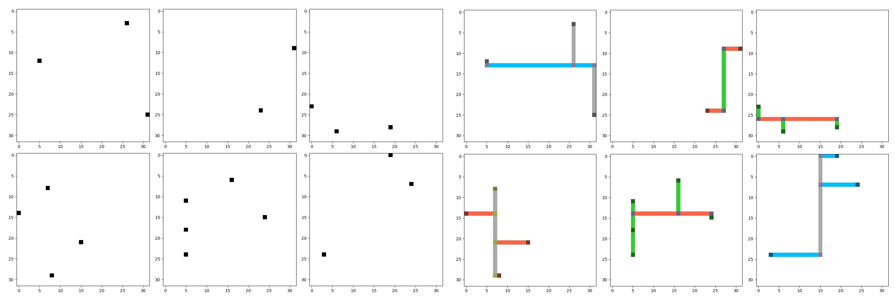

# Deep-Route

This repository contains PyTorch implementation and dataset generation code for the paper

**[Training a Fully Convolutional Neural Network to Route Integrated Circuits](https://arxiv.org/abs/1706.08948)**
<br>
[Sambhav R. Jain](https://sites.google.com/view/sjain/home), Kye Okabe
<br>
arXiv-cs.CV (Computer Vision and Pattern Recognition) 2017

We design and train a deep, fully convolutional neural network that learns to route a circuit layout net with appropriate choice of metal tracks and wire class combinations. Inputs to the network are the encoded layouts containing spatial location of pins to be routed. After 15 fully convolutional stages followed by a score comparator, the network outputs 8 layout layers (corresponding to 4 route layers, 3 via layers and an identity-mapped pin layer) which are then decoded to obtain the routed layouts.

**Proposed FCN Model**


**Training samples (left: data, right: labels) from the generated dataset**


## Install (Linux)
1. Fork [this GitHub repository](https://github.com/sjain-stanford/deep-route)
2. Setup virtualenv and install dependencies
     * `./setup_virtualenv.sh`
3. Install PyTorch
     * `./setup_pytorch.sh` 
4. Activate virtualenv, start Jupyter notebook
    * `./start_jupyter_env.sh`

## Generate Dataset
Run the script `./datagen/gen_data.py` to generate training data of shape (N, 1, H, W) and labels of shape (N, 8, H, W) stored using [HDF5 (h5py)](https://github.com/h5py/h5py). Default parameters used for the paper are `H = W = 32`, and `pin_range = (2, 6)`, but feel free to modify as desired.
```
python ./datagen/gen_data.py
>> Enter the number of images to be generated: 50000
mv ./data/layout_data.hdf5 ./model/data/train_50k_32pix.hdf5

python ./datagen/gen_data.py
>> Enter the number of images to be generated: 10000
mv ./data/layout_data.hdf5 ./model/data/val_10k_32pix.hdf5
```

## Train FCN Model (PyTorch)
Switch to `./model/` dir and run the script `./train_fcn_pytorch.py` to train the FCN model with default options, or use the switch `--help` to display a list of options and their defaults.
```
cd ./model/
python ./train_fcn_pytorch.py --help
```

```
usage: train_fcn_pytorch.py [-h] [--data PATH] [--batch_size N]
                            [--num_workers N] [--num_epochs N] [--use_gpu]
                            [--pretrained] [--lr LR] [--adapt_lr] [--reg REG]
                            [--print-freq N]

Deep-Route: Training a deep FCN network to route circuit layouts.

optional arguments:
  -h, --help       show this help message and exit
  --data PATH      path to dataset (default: ./data/)
  --batch_size N   mini-batch size (default: 100)
  --num_workers N  number of data loading workers (default: 4)
  --num_epochs N   number of total epochs to run (default: 200)
  --use_gpu        use GPU if available
  --pretrained     use pre-trained model
  --lr LR          initial learning rate (default: 5e-4)
  --adapt_lr       use learning rate schedule
  --reg REG        regularization strength (default: 1e-5)
  --print-freq N   print frequency (default: 10)
```

To run on GPU, provide switch `--use_gpu`. Best model parameters (based on F-1 score on validation set) are saved to `./model/training/` dir every epoch, along with loss and training curves. If the switch `--pretrained` is provided, model is pre-loaded with saved parameters before training. With `--adapt_lr`, a learning rate delay by factor of 10 is applied every 30 epochs.

## Cite
If you find this work useful in your research, please cite:
```
@article{jain2017route,
  title={Training a Fully Convolutional Neural Network to Route Integrated Circuits},
  author={Jain, Sambhav R and Okabe, Kye},
  journal={arXiv preprint arXiv:1706.08948},
  year={2017}
}
```
